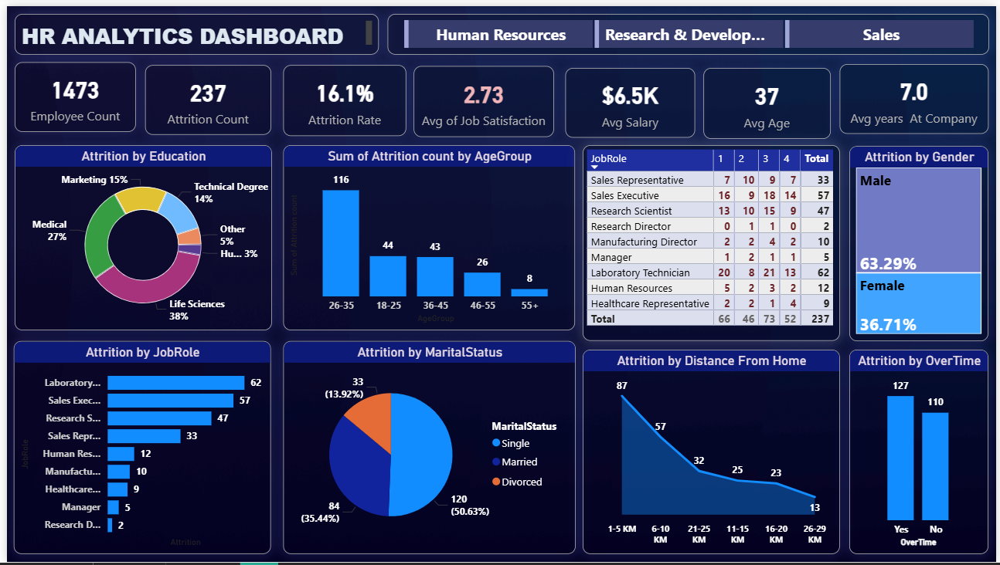
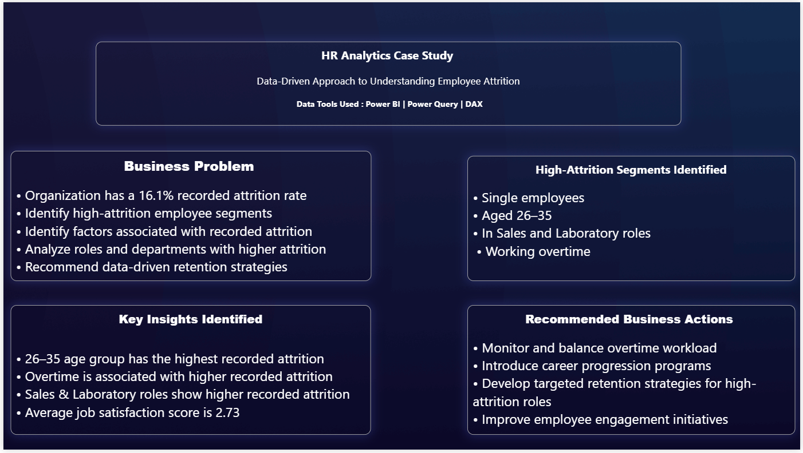

#  HR Analytics – Employee Attrition Analysis

##  Project Overview

This project analyzes employee attrition using **Microsoft Power BI** to identify important attrition patterns, understand high-attrition employee segments, and develop data-driven HR recommendations.

The dashboard combines **Power Query, DAX measures, calculated columns, data modeling, and interactive visualizations** to transform employee data into actionable business insights.

---

##  Business Problem

The organization has a **16.1% employee attrition rate**. The objective of this analysis is to help HR understand where attrition is concentrated and identify employee segments that require further investigation.

Key business questions:

- Which age groups have the highest attrition?
- Which job roles have the highest recorded attrition?
- How is attrition distributed by gender and marital status?
- How does job satisfaction vary across high-attrition roles?
- How does overtime relate to recorded attrition?
- How is attrition distributed by distance from home?
- Which employee segments should HR investigate further?

---

##  Tools & Technologies

- **Microsoft Power BI**
- **Power Query** – Data preparation and transformation
- **DAX** – Measures and business metrics
- **Calculated Columns** – Employee segmentation
- **Data Modeling**
- **Interactive Data Visualization**
- **Business Analysis**

---

##  Key KPIs

| KPI | Value |
|---|---:|
| Employee Count | **1,473** |
| Attrition Count | **237** |
| Attrition Rate | **16.1%** |
| Average Job Satisfaction | **2.73** |
| Average Salary | **$6.5K** |
| Average Age | **37** |
| Average Years at Company | **7.0** |

---

##  Analytical Process

**Data Preparation → Data Modeling → DAX Measures → Calculated Column → Dashboard Development → Insight Generation → Business Recommendations**

### Data Preparation & Modeling

- Prepared the HR dataset using Power Query.
- Structured employee attributes for analysis.
- Created DAX measures for key workforce KPIs.
- Created a calculated **Distance From Home** segmentation:
  - 1–5 KM
  - 6–10 KM
  - 11–15 KM
  - 16–20 KM
  - 21–25 KM
  - 26–29 KM

---

#  Key Insights

###  Age

The **26–35 age group** has the highest recorded attrition with **116 cases**.

###  Job Role

The roles with the highest recorded attrition are:

- **Laboratory Technician – 62**
- **Sales Executive – 57**
- **Research Scientist – 47**
- **Sales Representative – 33**

###  Job Satisfaction & Job Role

A matrix was created using **Job Role, Job Satisfaction, and Attrition Count** to examine how recorded attrition is distributed across satisfaction levels.

Key findings:

- **Job Satisfaction level 3** has the highest recorded attrition count with **73 cases**.
- Laboratory Technician has the highest total recorded attrition at **62 cases**.
- Sales Executive follows with **57 cases**.
- Research Scientist records **47 cases**.

This analysis helps HR identify roles and satisfaction segments that may require deeper investigation.

###  Overtime

Recorded attrition is:

- **127 cases** among employees working overtime
- **110 cases** among employees not working overtime

The analysis indicates an association between overtime and recorded employee attrition, but does not establish causation.

###  Marital Status

Single employees represent the largest share of recorded attrition:

- **Single – 120 (50.63%)**
- **Married – 84 (35.44%)**
- **Divorced – 33 (13.92%)**

###  Gender

Recorded attrition is distributed as:

- **Male – 63.29%**
- **Female – 36.71%**

###  Distance From Home

The **1–5 KM** group has the highest recorded attrition with **87 cases**.

---

#  Business Recommendations

Based on the analysis, the following actions can be considered:

1. **Monitor and balance overtime workload**, particularly in higher-attrition roles.

2. **Focus retention analysis on high-attrition roles**, especially Laboratory Technician, Sales Executive, and Research Scientist.

3. **Strengthen career progression programs** through development opportunities, mentoring, and internal mobility.

4. **Investigate employee satisfaction patterns** within high-attrition roles and segments.

5. **Develop targeted retention strategies** for employee groups showing higher recorded attrition rather than applying a single approach across the workforce.

---

#  Dashboard Preview

## HR Analytics Dashboard



## HR Analytics Business Case



---

#  Repository Contents

```text
HR-Attrition-Analysis/
│
├── README.md
├── dashboard-overview.png
├── business-case.png
├── HR-Analytics-Dashboard.pbix
└── hr-dataset.csv
```

---

#  Project Outcome

This project demonstrates an end-to-end **HR Analytics and Business Intelligence workflow**, from data preparation and metric development to dashboard creation, insight generation, and business recommendations.

The dashboard provides HR stakeholders with a structured view of employee attrition patterns and highlights areas for further investigation and retention planning.

---

##  Author

**Mohan Thurpati**

Aspiring Data Analyst

**Skills:** Power BI | Power Query | DAX | Data Modeling | Data Visualization | Business Analysis | HR Analytics
