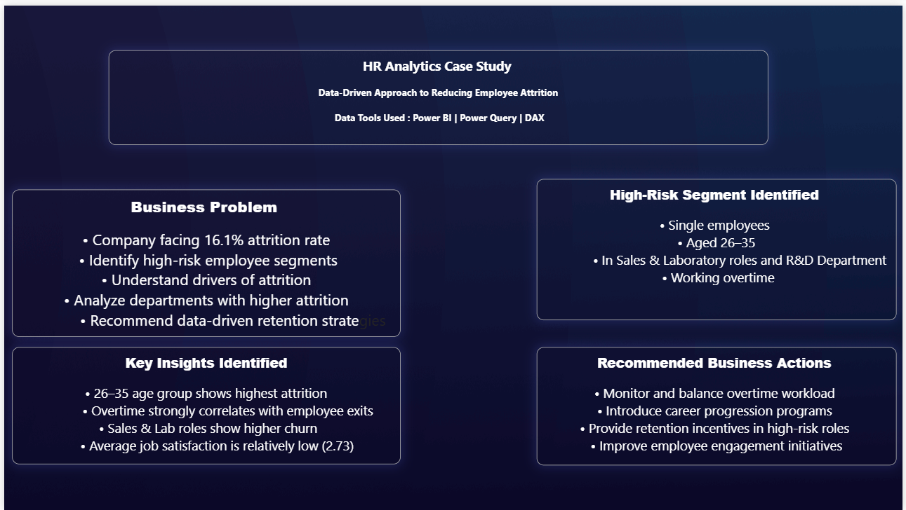

#HR-Analytics-Employee-Attrition-Case-Study

 ##Project Overview

This project analyzes employee attrition patterns using Power BI to identify high-risk segments and recommend data-driven retention strategies.

The company has a 16.1% attrition rate, and this dashboard helps HR teams understand key drivers of employee turnover.

##Business Problem

Identify high-risk employee segments

Understand factors driving attrition

Analyze departments with higher churn

Provide strategic retention recommendations

##Tools Used

Power BI

Power Query

DAX

##Key KPIs

Total Employees: 1473

Attrition Count: 237

Attrition Rate: 16.1%

Average Job Satisfaction: 2.73

Average Salary: $6.5K

Average Age: 37

##Key Insights

Employees aged 26–35 show highest attrition

Overtime strongly correlates with employee exits

Sales & Laboratory roles show higher attrition

Single employees are more likely to leave

Lower job satisfaction linked to higher churn

##Business Recommendations

Balance overtime workload

Introduce structured career progression programs

Provide retention incentives for high-risk roles

Improve employee engagement initiatives

## 📷 Dashboard Preview

